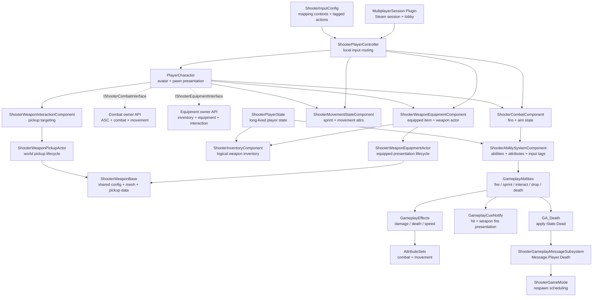

# ShooterGame

UE5.7 多人第三人称射击项目，围绕 GAS、服务端权威和生命周期清晰的武器系统构建。

## Demo

Demo 视频 / GIF 暂未放入公开仓库。

## Overview

- ShooterGame 是一个个人开发的多人射击项目。它的目标不是只把角色、武器和 UI 跑起来，而是把常见射击玩法拆成可以长期迭代的系统边界：玩家长期状态、当前 Pawn 表现、武器逻辑、GAS 能力、伤害流程和联机会话各自承担清晰职责。

- 项目当前已经形成一个 V1 玩法闭环：玩家可以移动、瞄准、冲刺、拾取武器、装备/切换/丢弃武器，使用命中扫描或投射物武器造成 GAS 伤害，并通过 GameplayCue 播放命中/开火表现，在死亡后经历状态清理和重生流程。

- 架构上:
`PlayerState` 负责跨 Pawn 生命周期存在的玩家状态
`Character` 负责当前身体和表现
`Components` 负责局部 Gameplay 能力
`GameplayAbilitySystem` 负责输入意图分发、能力激活、属性修改和状态标记
`Messages` 负责把死亡等跨系统事件从 Ability 发送到规则层

## Features

- Third-person movement: 移动、跳跃、蹲伏、瞄准、冲刺
- Weapon loop: 拾取、装备、切换、丢弃、死亡掉落
- Combat paths: 命中扫描武器和投射物武器
- GAS damage: 属性、伤害执行、死亡状态、移动速度效果
- Gameplay cues: 命中特效、枪口特效和开火音效由独立 GameplayCueNotify 处理
- Input config: Enhanced Input 的 MappingContext / InputAction 由 `UShooterInputConfig` 资产声明，Controller 只按 GameplayTag 绑定
- Ability input tags: Fire / Sprint / Interact / Drop 通过输入 GameplayTag 路由到组件状态和 Ability
- Owner interfaces: Combat / Equipment 组件通过 Owner Interface 获取依赖，降低对 `PlayerCharacter` 的硬编码
- Weapon actor split: 世界拾取 Actor 和已装备 Actor 分离，库存保存逻辑条目和两种表现类
- Respawn flow: 死亡表现、状态清理、重生前属性恢复
- Multiplayer flow: Steam Session / Lobby 原型插件
- Gameplay UI adapters: 生命值、准星、拾取提示等 C++ 适配层

## Technical Highlights

1. **ASC on PlayerState**  
   `AbilitySystemComponent` 放在 `PlayerState`，让能力、属性和状态可以跨 Pawn 死亡与重生延续。

2. **Character as Avatar**  
   `Character` 在 `PossessedBy` 和 `OnRep_PlayerState` 中重新绑定 ASC ActorInfo，只负责当前 Pawn 的移动/视角、表现和 Avatar 生命周期。

3. **Inventory / Equipment split**  
   `Inventory` 是玩家长期逻辑库存，`Equipment` 是当前 Pawn 的装备表现和交互状态。库存条目保存 `WeaponDefinition`、弹药快照、PickupActorClass 和 EquipmentActorClass，避免任何武器 Actor 成为库存真相来源。

4. **Server-authoritative weapon flow**  
   拾取、装备、丢弃、伤害和死亡都由服务端裁决，客户端负责请求、提示和复制后的表现刷新。

5. **AbilityTask-driven fire loop**
   `GA_FireWeapon` 统一开火入口，并使用 `AbilityTask_WaitDelay` 驱动自动开火循环。每一发都走同一个 `FireSingleShot` 校验和可选 Cost / Cooldown GameplayEffect 提交点。

6. **GameplayCue presentation layer**
   命中和武器开火表现从 `PlayerCharacter` 移到 `GameplayCueNotify_Burst` 子类，角色不再承担特效/音效分发职责。

7. **InputTag-driven Ability activation**
   `UShooterAbilitySystemComponent` 通过 `Input.*` GameplayTag 查找并激活 Ability，让组件只表达输入意图，而不是直接按 AbilityTag 激活或取消能力。

8. **Enhanced Input config boundary**
   `UShooterInputConfig` DataAsset 保存 MappingContext、NativeInputActions 和 AbilityInputActions；`UShooterInputComponent` 提供 tag-based 绑定模板；`AShooterPlayerController` 负责把本地输入分发给 Pawn 行为、组件状态或 ASC fallback。`APlayerCharacter` 不再暴露 `StartXxxInput` 输入门面。

9. **Componentized Character responsibilities**
   战斗、生命、移动、库存、装备、交互检测拆到独立组件；Combat / Equipment 组件通过 Owner Interface 访问 ASC、库存、装备和交互组件，避免把组件写死在 `APlayerCharacter` 上。

10. **GameplayTag-driven death state**
   死亡状态不再由 `APlayerCharacter` 复制 `bIsDead`，而是由 `State.Dead` GameplayTag 驱动。Pawn 监听 ASC Tag 变化，只负责播放死亡表现和关闭当前身体。

11. **Gameplay message respawn boundary**
   `GA_Death` 应用死亡状态后广播 `Message.Player.Death`，`ShooterGameMode` 订阅消息并安排重生。Ability 不再直接调用 GameMode。

12. **Session system as plugin**
   Steam Session / Lobby 流程放在 `MultiplayerSession` 插件里，与核心战斗代码保持边界。

## Architecture



## Project Structure

```text
Source/
  ShooterGame/
    AbilitySystem/     GAS abilities, effects, attributes, tags
      GameplayCues/    GameplayCueNotify classes for combat presentation
    Character/         Player pawn, ASC avatar binding
    Components/        Combat, health, movement, inventory, equipment
    Input/             InputConfig data asset and tag-based input component
    Interfaces/        Owner-facing component contracts
    GameMode/          Death and respawn rules
    Messages/          World-level gameplay event broadcasts
    PlayerState/       ASC, attributes, long-lived player state
    Weapon/            Weapon base, pickup actor, equipment actor, instance, data model

Plugins/
  MultiplayerSession/
    Source/            Steam Session / Lobby plugin code

Config/                UE project configuration
```

## Code Entry Points

- `Source/ShooterGame/Public/PlayerState/ShooterPlayerState.h`
  ASC、属性集、库存组件和启动 Ability 授权的长期所有者。

- `Source/ShooterGame/Public/AbilitySystem/ShooterAbilitySystemComponent.h`
  通过输入 GameplayTag 分发 Ability press/release 的项目 ASC 扩展。

- `Source/ShooterGame/Public/Character/PlayerCharacter.h`
  当前 Pawn、GAS Avatar、移动/视角和表现组件聚合点；实现 Combat / Equipment Owner 接口。

- `Source/ShooterGame/Public/Controller/ShooterPlayerController.h`
  本地 Enhanced Input 绑定和输入路由。Native 输入直接驱动 Pawn/组件状态，Ability 输入通过 `Input.*` tag 进入对应组件或 ASC fallback。

- `Source/ShooterGame/Public/Input/ShooterInputConfig.h`
  输入资产边界：MappingContext、NativeInputActions、AbilityInputActions 统一由 DataAsset 配置。

- `Source/ShooterGame/Public/Interfaces/`
  组件和 Ability 访问 Owner 能力的边界，避免直接依赖具体玩家 Pawn 类型。

- `Source/ShooterGame/Public/Components/ShooterInventoryComponent.h`
  武器逻辑库存、槽位、弹药和稳定 ItemId。

- `Source/ShooterGame/Public/Components/ShooterWeaponEquipmentComponent.h`
  拾取、装备、切换、丢弃和死亡掉落流程。

- `Source/ShooterGame/Public/AbilitySystem/Abilities/GA_FireWeapon.h`
  命中扫描与投射物武器的统一开火 Ability；自动开火由 `AbilityTask_WaitDelay` 循环驱动。

- `Source/ShooterGame/Public/AbilitySystem/Abilities/GA_InteractWeapon.h`
  服务端权威拾取世界武器的交互 Ability。

- `Source/ShooterGame/Public/AbilitySystem/Abilities/GA_DropWeapon.h`
  服务端权威丢弃当前武器的 Ability。

- `Source/ShooterGame/Public/AbilitySystem/GameplayCues/`
  命中和开火表现的 GameplayCueNotify 实现。

- `Source/ShooterGame/Public/Weapon/ShooterWeaponBase.h`
  武器共享配置、网格、枪口和 `FWeaponPickupData` 快照。

- `Source/ShooterGame/Public/Weapon/ShooterWeaponPickupActor.h`
  世界拾取生命周期、拾取可用状态、拾取提示和丢弃后的本地抛物线表现。

- `Source/ShooterGame/Public/Weapon/ShooterWeaponEquipmentActor.h`
  已装备武器生命周期，负责附着到角色 Mesh，不承担世界拾取职责。

- `Source/ShooterGame/Public/Messages/ShooterGameplayMessageSubsystem.h`
  当前用于广播 `Message.Player.Death`，把死亡 Ability 和 GameMode 重生规则隔开。

- `Source/ShooterGame/Public/GameMode/ShooterGameMode.h`
  订阅死亡消息并安排旧 Pawn 清理、PlayerState 状态重置和重生。

- `Plugins/MultiplayerSession/Source/MultiplayerSession/Public/MultiplayerSessionsSubsystem.h`
  Steam Session 创建、查找、加入和销毁入口。

## Repository Scope

这个公开仓库是源码版本，不包含完整运行所需的内容资产。

未公开跟踪的内容包括：

- `Content/`
- `assets/`
- `Binaries/`
- `Intermediate/`
- `Saved/`
- `Build/`
- `.uasset` / `.umap` / 原始美术与音频资源

如果要完整运行项目，需要本地配套未公开的内容资产，并使用 UE5.7 打开 `ShooterGame.uproject`。
