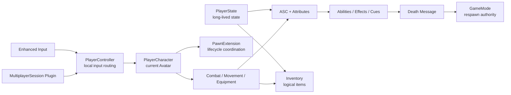

# ShooterGame

UE5.7 多人第三人称射击项目，围绕 GAS、服务端权威和清晰的 Pawn 生命周期构建。

当前收敛为一张测试地图、可配置人数的 Listen Server 房间、一把固定 Hitscan 武器，重点是服务器权威、射击预测、弱网验证与网络性能优化。固定武器的出生与重生流程已实现，2026-10-05 开发者手动验证反馈无异常。保留 Steam 好友加入入口，本地双窗口用于日常调试，不增加固定分队和团队比赛规则。Git 保管代码、配置和重要文档，游戏资源与重启计划由本地单独保管。当前实现见 [架构文档](docs/architecture.md)，生命周期与验证记录见 [Pawn Lifecycle](docs/systems/pawn-lifecycle.md)。

## Overview

ShooterGame 是一个个人开发的多人射击项目。当前玩法包含移动、瞄准、冲刺、固定 Hitscan 武器、伤害、死亡和重生。拾取、切换和丢弃入口已停用，死亡不再掉落武器；旧交互类型和 Projectile 分支暂留，后续解除资源引用再删除。

项目重点不是堆叠功能，而是理解并落实 UE5 多人 Gameplay 的关键边界：

- `PlayerState` 保存跨 Pawn 生命周期存在的玩家状态。
- `Character` 代表当前身体和 ASC Avatar。
- Gameplay Components 承担局部职责，不让 Character 变成 God Object。
- GAS 负责能力、属性、状态 Tag、伤害和 GameplayCue。
- 服务器裁决武器、伤害、死亡和重生等权威状态。

## Features

- 第三人称移动：移动、跳跃、蹲伏、瞄准、冲刺
- 武器循环：服务器出生授予固定武器，死亡清理，重生重新授予
- 战斗路径：服务器权威 Hitscan；弹药目前仅初始化数据，射击预测尚未实现
- GAS：Ability、Effect、Attribute、GameplayTag、GameplayCue
- 生命周期：Possession、UnPossession、死亡、Pawn 销毁与重生
- 多人会话：Steam Session、Lobby、Invite、Travel 原型插件

## Architecture

