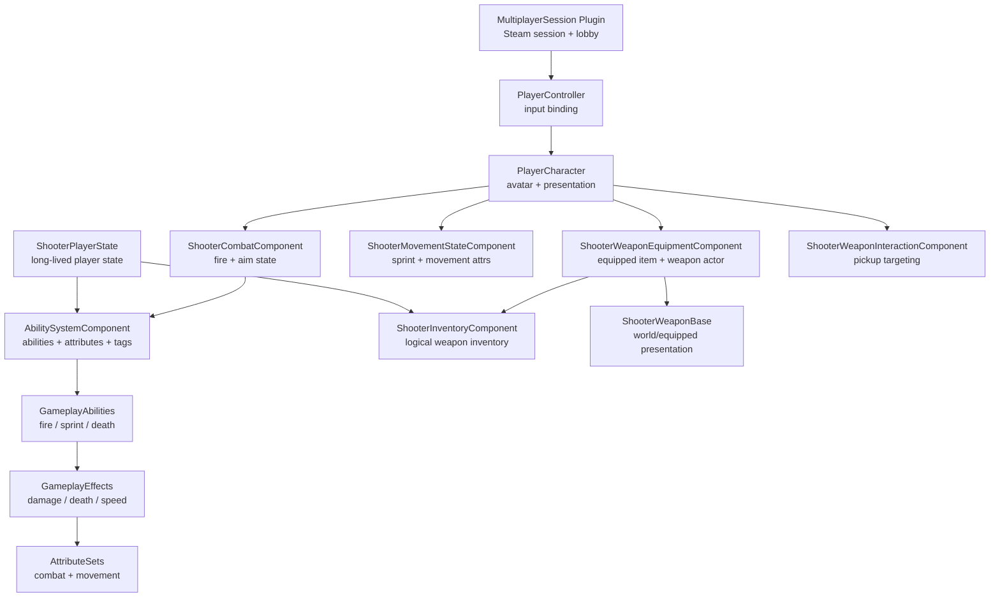

# ShooterGame

UE5.7 多人第三人称射击项目，围绕 GAS、服务端权威和生命周期清晰的武器系统构建。

## Demo

Demo 视频 / GIF 暂未放入公开仓库。

## Overview

- ShooterGame 是一个个人开发的多人射击项目。它的目标不是只把角色、武器和 UI 跑起来，而是把常见射击玩法拆成可以长期迭代的系统边界：玩家长期状态、当前 Pawn 表现、武器逻辑、GAS 能力、伤害流程和联机会话各自承担清晰职责。

- 项目当前已经形成一个 V1 玩法闭环：玩家可以移动、瞄准、冲刺、拾取武器、装备/切换/丢弃武器，使用命中扫描或投射物武器造成 GAS 伤害，并在死亡后经历状态清理和重生流程。

- 架构上:
`PlayerState` 负责跨 Pawn 生命周期存在的玩家状态
`Character` 负责当前身体和表现
`Components`负责局部 Gameplay 能力
`GameplayAbilitySystem` 负责能力激活、属性修改和状态标记

## Features

- Third-person movement: 移动、跳跃、蹲伏、瞄准、冲刺
- Weapon loop: 拾取、装备、切换、丢弃、死亡掉落
- Combat paths: 命中扫描武器和投射物武器
- GAS damage: 属性、伤害执行、死亡状态、移动速度效果
- Respawn flow: 死亡表现、状态清理、重生前属性恢复
- Multiplayer flow: Steam Session / Lobby 原型插件
- Gameplay UI adapters: 生命值、准星、拾取提示等 C++ 适配层

## Technical Highlights

1. **ASC on PlayerState**  
   `AbilitySystemComponent` 放在 `PlayerState`，让能力、属性和状态可以跨 Pawn 死亡与重生延续。

2. **Character as Avatar**  
   `Character` 在 `PossessedBy` 和 `OnRep_PlayerState` 中重新绑定 ASC ActorInfo，只负责当前 Pawn 的输入、表现和 Avatar 生命周期。

3. **Inventory / Equipment split**  
   `Inventory` 是玩家长期逻辑库存，`Equipment` 是当前 Pawn 的装备表现和交互状态，避免武器 Actor 成为库存真相来源。

4. **Server-authoritative weapon flow**  
   拾取、装备、丢弃、伤害和死亡都由服务端裁决，客户端负责请求、提示和复制后的表现刷新。

5. **Unified fire ability**  
   `GA_FireWeapon` 统一开火入口，再根据武器配置分发命中扫描或投射物路径。

6. **Componentized Character responsibilities**  
   战斗、生命、移动、库存、装备、交互检测拆到独立组件，减少 `Character` 膨胀。

7. **Session system as plugin**  
   Steam Session / Lobby 流程放在 `MultiplayerSession` 插件里，与核心战斗代码保持边界。

## Architecture



## Project Structure

```text
Source/
  ShooterGame/
    AbilitySystem/     GAS abilities, effects, attributes, tags
    Character/         Player pawn, ASC avatar binding
    Components/        Combat, health, movement, inventory, equipment
    GameMode/          Death and respawn rules
    PlayerState/       ASC, attributes, long-lived player state
    Weapon/            Weapon actor, instance, data model

Plugins/
  MultiplayerSession/
    Source/            Steam Session / Lobby plugin code

Config/                UE project configuration
```

## Code Entry Points

- `Source/ShooterGame/Public/PlayerState/ShooterPlayerState.h`  
  ASC、属性集、库存组件的长期所有者。

- `Source/ShooterGame/Public/Character/PlayerCharacter.h`  
  当前 Pawn、GAS Avatar、输入入口和表现组件聚合点。

- `Source/ShooterGame/Public/Components/ShooterInventoryComponent.h`  
  武器逻辑库存、槽位、弹药和稳定 ItemId。

- `Source/ShooterGame/Public/Components/ShooterWeaponEquipmentComponent.h`  
  拾取、装备、切换、丢弃和死亡掉落流程。

- `Source/ShooterGame/Public/AbilitySystem/Abilities/GA_FireWeapon.h`  
  命中扫描与投射物武器的统一开火 Ability。

- `Plugins/MultiplayerSession/Source/MultiplayerSession/Public/MultiplayerSessionsSubsystem.h`  
  Steam Session 创建、查找、加入和销毁入口。

## Repository Scope

这个公开仓库是源码版本，不包含完整运行所需的内容资产。

未公开跟踪的内容包括：

- `Content/`
- `assets/`
- `docs/`
- `Binaries/`
- `Intermediate/`
- `Saved/`
- `Build/`
- `.uasset` / `.umap` / 原始美术与音频资源

如果要完整运行项目，需要本地配套未公开的内容资产，并使用 UE5.7 打开 `ShooterGame.uproject`。
