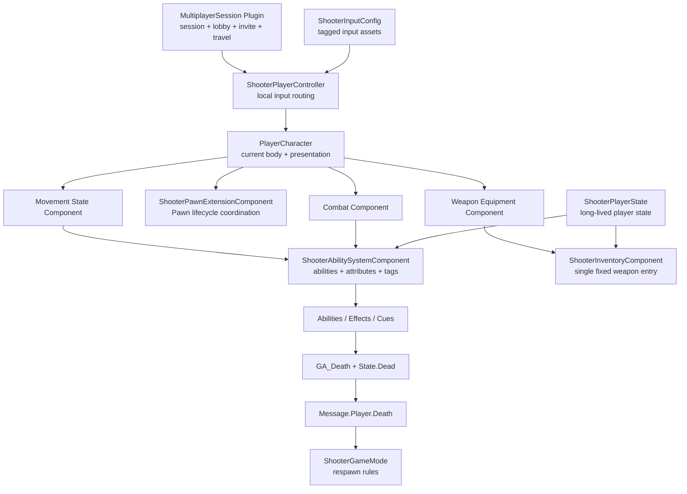

# ShooterGame Architecture

本文是当前架构的唯一事实来源。它描述已经存在的职责和运行时关系；没有从代码或运行结果确认的内容会明确标记为“待验证”。

## System Overview



## Ownership, Authority, Lifetime, Replication

| 状态或对象 | Owner / 所在位置 | Lifetime | Authority / 写入方 | Replication / 客户端职责 |
|---|---|---|---|---|
| ASC、AttributeSet | `AShooterPlayerState` | 玩家状态生命周期，跨当前 Pawn 重生存在 | Gameplay 权威修改由服务器执行 | ASC 按 GAS 规则复制；Pawn 重新绑定为 Avatar |
| 固定武器条目 | `UShooterInventoryComponent` on PlayerState | 组件跨 Pawn 存在；唯一条目在死亡时移除、新 Pawn 初始化时重新授予 | 服务器从 WeaponDataAsset 授予、删除；不支持槽位或拾取转移 | `InventoryEntries` OwnerOnly 复制，客户端刷新本地装备实例 |
| 当前 Avatar | `APlayerCharacter` | 单个 Pawn 的 Spawn 到 EndPlay | 服务器 Possess；两端根据已知 PlayerState/Controller 初始化表现 | Pawn 与 Controller/PlayerState 复制回调触发幂等检查 |
| Pawn 生命周期编排 | `UShooterPawnExtensionComponent` on Character | 与当前 Pawn 相同 | 不拥有权威 Gameplay 数据，只协调当前端绑定与清理 | 组件本身不表达新的复制真相 |
| Equipped item id | `UShooterWeaponEquipmentComponent` on Character | 当前 Pawn | 服务器授予固定武器、死亡清理 | OwnerOnly 复制，Owner 根据 Inventory 构建 transient weapon instance；客户端临时解绑不抹掉复制字段 |
| Equipped weapon actor | 当前 Character 的 Equipment Component 创建 | 当前装备/当前 Pawn | 仅服务器 Spawn/Destroy | Actor 指针复制给客户端，客户端只刷新附着和表现 |
| `State.Dead` | PlayerState-owned ASC | 由死亡 Effect 到重生重置 | ServerOnly Death Ability 应用 | 客户端监听 Tag，切换当前 Pawn 表现 |
| Session / Lobby | `MultiplayerSession` GameInstance 子系统和 UI 边界 | GameInstance / 当前 UI 生命周期 | Host 创建 Session 并执行 ServerTravel | Join 成功后本地 PlayerController 执行 ClientTravel |

### Seamless Travel boundary

Session 插件的 `StartHostedGame()` 路径会在 Authority 端设置 `GameMode->bUseSeamlessTravel = true` 后执行 `ServerTravel`。这证明项目启用了 Seamless Travel 路径，但当前文档没有足够运行证据证明 ASC、Inventory、PawnExtension 和 UI 在完整旅行前后都保持正确；该场景仍标记为待验证。

## Runtime Flow 1: Pawn Initialization

```text
BeginPlay / OnRep_PlayerState / NotifyControllerChanged
  -> PawnExtension.CheckDefaultInitialization
  -> resolve ShooterPlayerState and its ASC
  -> detach stale Avatar when necessary
  -> PlayerState.InitializeAbilitySystem(CurrentPawn)
  -> ASC Owner = PlayerState, Avatar = CurrentPawn
  -> bind Health / Movement / State.Dead delegate
  -> apply dead or alive presentation from current Tag state
  -> refresh Equipment: authority grants fixed Hitscan weapon, clients refresh presentation
```

`PossessedBy` 由引擎的 Controller 变更路径最终进入 `NotifyControllerChanged`；客户端在 `OnRep_PlayerState` 后补齐依赖。所有入口调用同一套幂等检查，不各自复制初始化逻辑。详细清理顺序见 [Pawn 生命周期文档](systems/pawn-lifecycle.md)。

## Runtime Flow 2: Fire, Damage, Death, Respawn

```text
local input
  -> ShooterPlayerController routes Input.* tag
  -> Combat.StartFireInput / ServerStartFire RPC
  -> ShooterAbilitySystemComponent activates GA_FireWeapon (ServerOnly)
  -> server-authoritative FireSingleShot
  -> hitscan trace
  -> Damage GameplayEffect / AttributeSet
  -> GameplayEvent.Death
  -> GA_Death (ServerOnly)
  -> apply State.Dead + broadcast Message.Player.Death
  -> ShooterGameMode schedules respawn
  -> UnPossess + destroy old Pawn
  -> PlayerState.ResetCombatStateForRespawn
  -> RestartPlayer
  -> new Pawn binds to the same PlayerState-owned ASC
  -> authority grants/equips the default Hitscan weapon with default ammo data
```

- 自动开火由 `AbilityTask_WaitDelay` 驱动，不依赖 Actor Tick。
- `State.Dead` 是死亡事实；Character 的碰撞、移动、输入和 Montage 只是当前 Pawn 的表现。
- GameMode 负责重生规则，Ability 不直接调用 `RestartPlayer`。
- 当前死亡处理销毁装备 Actor 并删除对应 Inventory 条目，不生成掉落；新 Pawn 自动获得默认武器。拾取、切槽位、丢弃、掉落表现和 Projectile 的代码、输入与对应资源已移除。
- 默认武器配置在 Equipment 的 `DefaultWeaponDefinition`，原生默认值为现有 `DA_Weapon_AK47`。仍沿用 WeaponInstance、Inventory OwnerOnly 复制和服务器创建武器 Actor 的链路，弹药目前仅初始化数据，未实现扣弹与预测。
- `FWeaponPickupData` / `PickupData` 沿用既有序列化名称，现在仅表示装备 Actor 的武器状态快照，不再支持世界拾取。

## Runtime Flow 3: Session and Travel

```text
Host
  -> MultiplayerSessionsSubsystem.CreateSession
  -> create callback
  -> Menu ServerTravel to Lobby
  -> host starts game
  -> enable seamless travel + ServerTravel to gameplay map

Client
  -> Find / Invite / JoinSession
  -> resolve connect address
  -> local PlayerController.ClientTravel(address)
```

Session 创建、搜索、加入、邀请和旅行位于 `MultiplayerSession` 插件。核心 ShooterGame Module 不负责在线服务回调；插件也不决定伤害、死亡或比赛 Gameplay 状态。

## System Boundaries

| 领域 | 负责 | 不负责 |
|---|---|---|
| Gameplay Framework | Controller、PlayerState、Pawn、GameMode 生命周期 | 在线服务实现、UI 布局 |
| GAS | Ability、Effect、Attribute、Tag、Cue | Session、Lobby、地图旅行规则 |
| Inventory / Equipment | 唯一固定武器条目、当前装备关系、武器 Actor 表现 | 拾取、切槽位、丢弃、比赛胜负、重生时机 |
| MultiplayerSession Plugin | Session、Lobby、Invite、Travel 和对应 UI 协调 | 武器、伤害和 ASC 状态 |
| UI | 读取状态、收集本地输入、显示反馈 | 直接写入服务器权威 Gameplay 状态 |

## Code Entry Points

| 关注点 | 入口 |
|---|---|
| PlayerState-owned ASC / Inventory | `Source/ShooterGame/Public/PlayerState/ShooterPlayerState.h` |
| Pawn 与组件聚合 | `Source/ShooterGame/Public/Character/PlayerCharacter.h` |
| Pawn 初始化和解绑 | `Source/ShooterGame/Public/Components/ShooterPawnExtensionComponent.h` |
| 输入 Tag 到 Ability | `Source/ShooterGame/Public/AbilitySystem/ShooterAbilitySystemComponent.h` |
| 逻辑库存 | `Source/ShooterGame/Public/Components/ShooterInventoryComponent.h` |
| 当前装备与武器 Actor | `Source/ShooterGame/Public/Components/ShooterWeaponEquipmentComponent.h` |
| 开火路径 | `Source/ShooterGame/Public/AbilitySystem/Abilities/GA_FireWeapon.h` |
| 死亡到重生消息边界 | `Source/ShooterGame/Public/Messages/ShooterGameplayMessageSubsystem.h` |
| 重生规则 | `Source/ShooterGame/Public/GameMode/ShooterGameMode.h` |
| Session / Join / Invite | `Plugins/MultiplayerSession/Source/MultiplayerSession/Public/MultiplayerSessionsSubsystem.h` |
| Lobby / Gameplay Travel | `Plugins/MultiplayerSession/Source/MultiplayerSession/` |

## Current Invariants and Known Limits

- 项目完成初始化后，ASC Owner 必须是 `AShooterPlayerState`，Avatar 必须是当前有效的 `APlayerCharacter`；解绑允许 Avatar 为空。引擎默认初始化会先临时使用 Owner 作为 Avatar。
- 旧 Pawn 只有在仍是 ASC Avatar 时才能清除 Avatar，不能误清新 Pawn 的绑定。
- 客户端不能 Spawn/Destroy 权威 Equipment Actor 或修改 Inventory 真相。
- PawnExtension 解绑必须允许从 UnPossess、Controller cleared 和 EndPlay 重复进入。
- 当前解绑将激活 Ability 统一视为 Pawn-scoped 并取消；未来若存在需要跨 Avatar 保留的 Ability，必须先明确新的保留契约。
- Inventory 当前使用 OwnerOnly `TArray` 复制，最多一个固定武器条目；不保留多槽位逻辑。
- Seamless Travel、Listen Server + Client 和 Dedicated Server 不得从静态代码推断为 PASS；具体结果跟随对应 system 文档维护。
